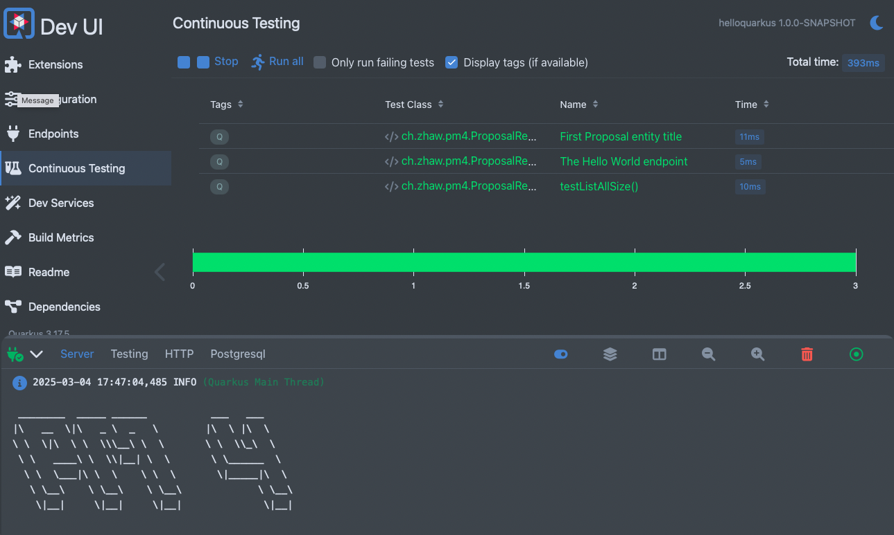
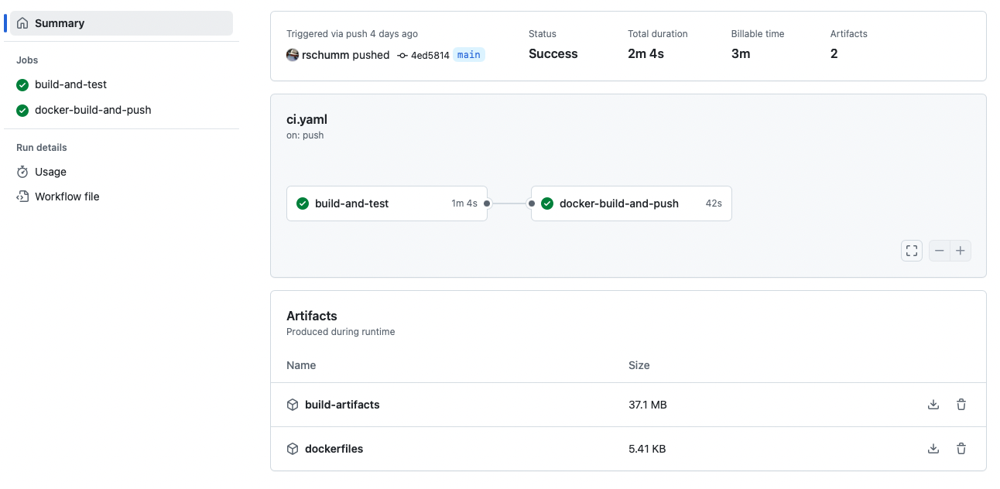
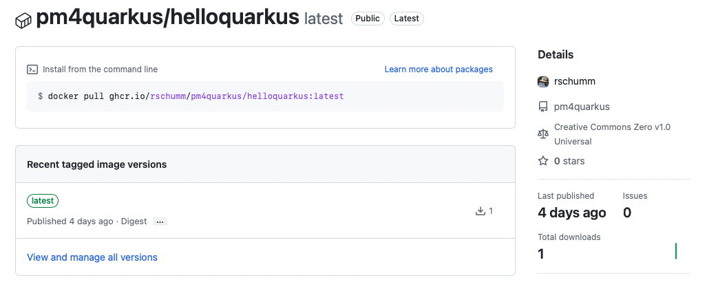
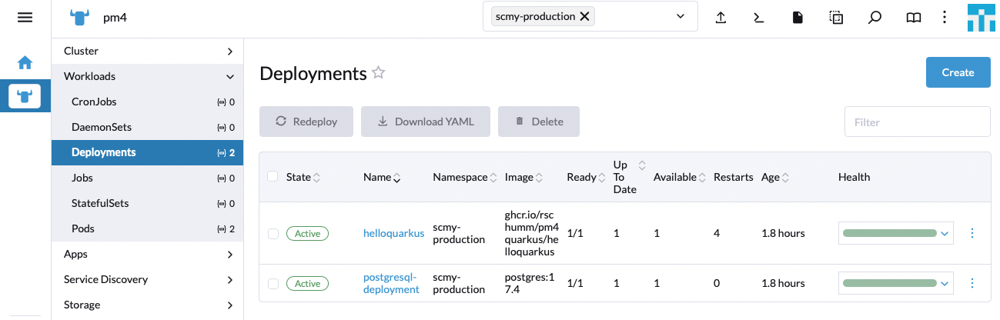
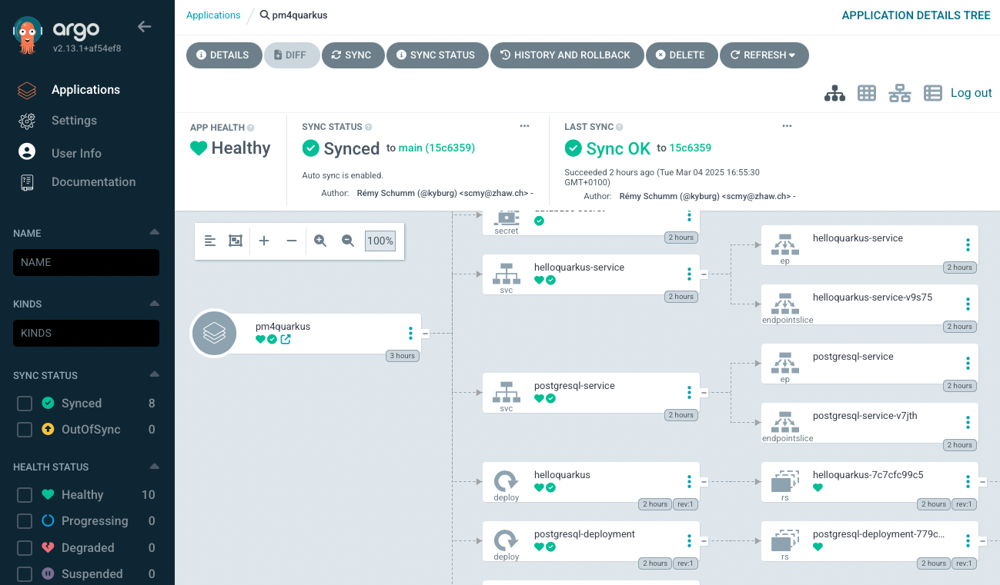
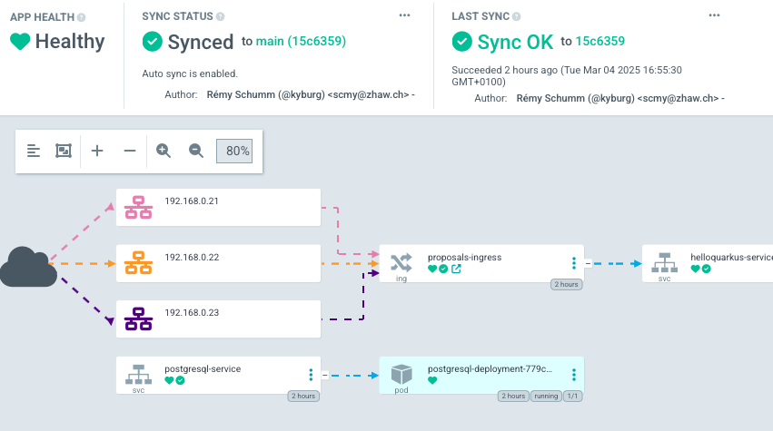

# helloquarkus - Blueprint Documentation 

This is a «HelloWorld» Blueprint Project based on [Quarkus](https://quarkus.io) used as a demonstration for PM4 at zhaw.   
We use it here just because the author likes Quarkus 😉  

The App just shows a list of PM4 Project Proposals stored in a PostgreSQL Database. 

Quarkus is an Open Source Java Framework for Cloud Native Applications sponsored by RedHat, which is designed to be fast, small and easy to use. It is a set of opinionated open source libraries and tools that are designed to work together. One of the additional key features is the ability to compile Java applications to native executables using [GraalVM](https://www.graalvm.org) - which is not used in this Project.  


> [!CAUTION]  
> for the author @scmy:  
> two git remotes for building purpose: `origin, public` - on upgrade publish on both. 


## Architecture / Demonstration Canvas 

The Project covers and showes following layers: 


| Stack | DEV (local) | Build and Test (on gitlab) | PROD (on cluster) |
|-------|-------------|-------------------|---|
| Build | Maven | Maven  | none |
| Operations | Quarkus Dev-Mode `quarkus dev`| `mvn package`, `docker build` | k8s Pods by ArgoCD |
| Hot Reoload | Quarkus Dev-Mode `quarkus dev | none | none |
| Database | Quarkus Dev-Services (PostgreSQL Testcontainers) | Quarkus Dev-Services (PostgreSQL Testcontainers) | PostgreSQL on k8s |
| Test Data | `import.sql` (Hibernate) | `import.sql` (Hibernate)  | flyway migration files |
| Database DDL generation | Hibernate through Panaché | Hibernate through Panaché | Hibernate through Panaché |
| Persistence | Panaché | Panaché | Panaché |
| Integration Tests | RestAssured | RestAssured | none |
| REST | Quarkus Jakarta REST | Quarkus Jakarta REST | Quarkus Jakarta REST |
| Web Frontend | Quarkus Qute | Quarkus Qute | Quarkus Qute |


Architecture Details see below.


# Run

## run DEV locally 

To start in hot-code mode use 

    quarkus dev 
    mvn quarkus:dev 

(`quarkus` is the Quarkus command line tool which can be installed via your preferred package manager.)

> [!IMPORTANT]  
> To run properly, it need a working Docker or Podman environment on the Development machine. Quarkus Dev Services will **automaticall run** and provide a **PostgreSQL** database in a container.  (If you don't have a container runtime on your machine, you have to provide a PostgreSQL Database manually and configure it in the `application.properties` file.)

pressing 
- `d` in dev mode opens the DevUI with the Endpoints and all sorts of other stuff (like Continous Tests, installed Extensions, OpenAPI GUI (aka Swagger), DB Connections, Config Parameters, Dependency Graph etc.)
- `w` will open the Application in the Browser.
- `r` will resume the continous integration tests. 
- `q` will quit the App.

Note: Quarkus will run Tests continously - Saving a File will trigger the Tests to run again and immediately show the results in the Console and the DevUI: 

On localhost, the Main View is served on [the Endpoint `/proposal/ui`](http://localhost:8085/proposal/ui) 





Note: to just test the application run `quarkus test` 


## run CI on GitHub Actions

Run the Action `CI for Quarkus Proposals App` by pushing to the Repository `main` branch. The Pipeline is defined in `.github/workflows/ci.yml` and will: 
- build the App
- run the Tests (including Integration Tests that use a PostgreSQL Database in a Testcontainer - this will be automatically started by the Testcontainers Library)
- create a Docker Image
- push the Docker Image to the GitHub Container Registry

The Pipeline in GitHub Actions View: 

> [!CAUTION]  
> This only works in the pulblic GitHub. ZHAW GitHub will need some additional configuration.




The Docker Image in the GitHub Container Registry:

> [!CAUTION]  
> This only works in the pulblic GitHub. ZHAW GitHub will not support GHCR.





## deploy PROD on cluster

To get a Cluster Access token on your local commandline (including [k9s](https://k9scli.io)): 

    rancher login {rancher_server_url} -t {api_token}


### Manual Deployment

The Application can be deployed to the Rancher / k3s Cluster manually by applying the Kubernetes Resources in the `operations` folder. 

This will trigger all the Services and Deployments in the Cluster. 

Viw of the Deployments in Rancher, showing the Quarkus App and the PostgreSQL Database running luckly: 



The Application can be accessed via the URL configured in the `Ingress` Resource. This is backed by an outomated [Traefik](https://traefik.io/traefik/) Ingress Controller that handles Reverse Proxying and SSL Termination. 


### Automated Deployment with ArgoCD

Additionally, the Application can be deployed to the Rancher / k3s Cluster automatically by using [ArgoCD](https://argoproj.github.io/cd/).  
For this, ArgoCD will watch the GitHub Repository and apply the Kubernetes Resources in the `operations` folder automatically to the Cluster.   
Ask the Teaching Assistant for ArgoCD Access.  

The monitored Appliation in ArgoCD will look like this:



ArgoCD can also visualise a simplifed Networking View: 




# Architecture Details

### PostgreSQL Database / Testcontainers

DEV:  

This project uses Quarkus Dev-Services for Databases in DEV mode.  
A PostgreSQL Database is started in a Docker Container automatically during DEV mode - using [Testcontainers](https://testcontainers.com) in the background.   
This happends «by convention», i.e. without any further configuration in the `application.properties` file. The System knows that it should start a PostgreSQL Database in a Container, because the Project uses the `quarkus-jdbc-postgresql` Extension.   
Testcontainers is running a `ryuk` container to manage the lifecycle of the containers, so that they are removed after the tests are run. This does not always work as expected, so you might have to remove the containers manually and clean up with `podman system prune -a --volumes` carefully. 

See:   
https://quarkus.io/guides/databases-dev-services


> [!TIP]  
> the current Database Connection parameters (the one running in a Container) can be looked up in the DevUI.  


PROD:

Production DB can be configured «normally» as described above.  
In Production, the Database is provided by the Kubernetes Cluster in «normal» way in a Pod. See the folder `operations`. 

### Panaché Persistence 

For Persistence, it uses a very pragmatic variant of Hibernate, called [Panaché](https://quarkus.io/guides/hibernate-orm-panache).  

Note: the Attributes of the Entity use `public` Java Variables - this is intentional, a feature of Panaché and not an anti-pattern!!  

### Integration Tests 

This Project Uses **[Restassured](https://rest-assured.io)** to run Integration Tests towards a **fully running Quarkus REST Endpoint** (using the above metionned Testcontainers PostgreSQL Database) and is not using any Mocks!   
The Tests are run continously in DEV mode in the console and can also be watched in the DevUI.   

Note: Running the `*IT` Tests in die IDE might fail, because the IDE does not know about the Testcontainers and the running PostgreSQL Database. Unsing `mvn test` will work.


### Web Frontend

To add own static web content see [Quarkus HTTP](https://quarkus.io/guides/http-reference) and [Quarkus Web](https://quarkus.io/guides/web). 

- The Qute Web extension allows you to directly serve via HTTP templates located in `src/main/resources/templates/pub/`. In that case you don’t need any Java code to "plug" the template, for example, the template `src/main/resources/templates/pub/foo.html` will be served from the paths /foo and /foo.html by default.
- For finer control, you can combine it with Quarkus REST to control how your template will be served. All files located in the `src/main/resources/templates` directory and its subdirectories are registered as templates and can be injected in a REST resource.

The default welcome page will then disappear when you add your own `index.html` file or so. 

The Application serves a very simple HTML Page with a list of PM4 Project Proposals based on the [Quarkus Qute Templating Engine](https://quarkus.io/guides/qute#qute-reference-guide). The Web Page is served by the Quarkus REST Endpoint just like the JSON Data. 

On localhost, the Main View is served on [the Endpoint `/proposal/ui`](http://localhost:8085/proposal/ui) 


# 🏗️ Quarkus Generated Documentation (for infroamtion)

This project uses Quarkus, the Supersonic Subatomic Java Framework.

If you want to learn more about Quarkus, please visit its website: <https://quarkus.io/>.

## Running the application in dev mode

You can run your application in dev mode that enables live coding using:

```shell script
./mvnw quarkus:dev
```

> **_NOTE:_**  Quarkus now ships with a Dev UI, which is available in dev mode only at <http://localhost:8080/q/dev/>.

## Packaging and running the application

The application can be packaged using:

```shell script
./mvnw package
```

It produces the `quarkus-run.jar` file in the `target/quarkus-app/` directory.
Be aware that it’s not an _über-jar_ as the dependencies are copied into the `target/quarkus-app/lib/` directory.

The application is now runnable using `java -jar target/quarkus-app/quarkus-run.jar`.

If you want to build an _über-jar_, execute the following command:

```shell script
./mvnw package -Dquarkus.package.jar.type=uber-jar
```

The application, packaged as an _über-jar_, is now runnable using `java -jar target/*-runner.jar`.

## Creating a native executable

You can create a native executable using:

```shell script
./mvnw package -Dnative
```

Or, if you don't have GraalVM installed, you can run the native executable build in a container using:

```shell script
./mvnw package -Dnative -Dquarkus.native.container-build=true
```

You can then execute your native executable with: `./target/helloquarkus-1.0.0-SNAPSHOT-runner`

If you want to learn more about building native executables, please consult <https://quarkus.io/guides/maven-tooling>.

## Related Guides

- REST ([guide](https://quarkus.io/guides/rest)): A Jakarta REST implementation utilizing build time processing and Vert.x. This extension is not compatible with the quarkus-resteasy extension, or any of the extensions that depend on it.
- Flyway ([guide](https://quarkus.io/guides/flyway)): Handle your database schema migrations
- Hibernate ORM with Panache ([guide](https://quarkus.io/guides/hibernate-orm-panache)): Simplify your persistence code for Hibernate ORM via the active record or the repository pattern
- JDBC Driver - PostgreSQL ([guide](https://quarkus.io/guides/datasource)): Connect to the PostgreSQL database via JDBC

## Provided Code

### Hibernate ORM

Create your first JPA entity

[Related guide section...](https://quarkus.io/guides/hibernate-orm)

[Related Hibernate with Panache section...](https://quarkus.io/guides/hibernate-orm-panache)


### REST

Easily start your REST Web Services

[Related guide section...](https://quarkus.io/guides/getting-started-reactive#reactive-jax-rs-resources)
